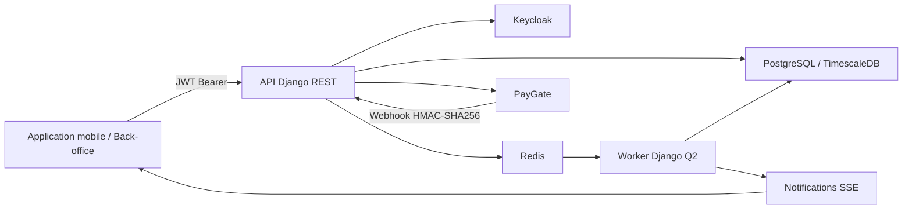
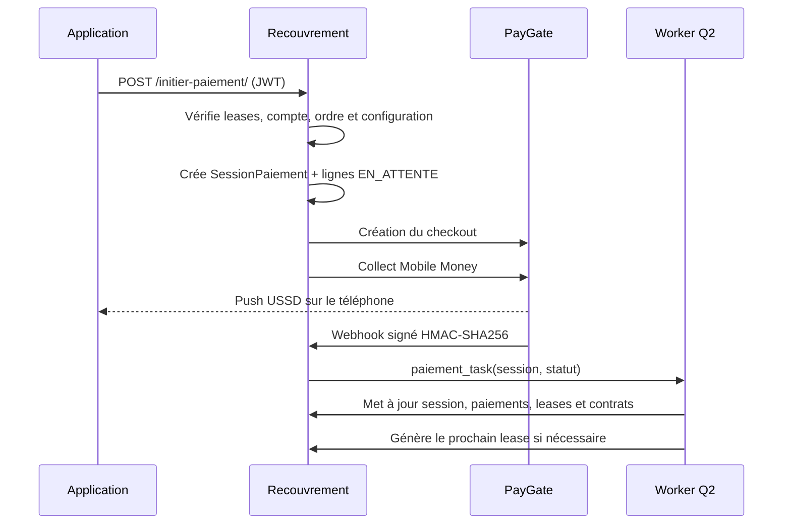

# Recouvrement — Gestion des contrats, échéances et paiements

> API multi-tenant de gestion du recouvrement : chauffeurs, contrats principaux et sous-contrats, génération planifiée des échéances (*leases*), paiements en espèces ou Mobile Money, pénalités, statistiques et notifications temps réel.

<p align="left">
  
  
  
  
  
  
</p>

---

## Sommaire

- [Aperçu](#aperçu)
- [Architecture](#architecture)
- [Règles métier principales](#règles-métier-principales)
- [Stack technique](#stack-technique)
- [Démarrage en développement](#démarrage-en-développement)
- [Authentification et autorisations](#authentification-et-autorisations)
- [Consommation de l’API](#consommation-de-lapi)
- [Génération des leases](#génération-des-leases)
- [Paiements](#paiements)
- [Tests](#tests)
- [Images Docker et déploiement](#images-docker-et-déploiement)
- [Structure du projet](#structure-du-projet)

---

## Aperçu

Recouvrement centralise le cycle de vie financier des contrats de location et de leurs accessoires. L’application permet notamment de :

- isoler strictement les données de chaque partenaire grâce au `compte_id` ;
- gérer les chauffeurs et leurs rôles avec Keycloak ;
- créer un contrat principal et ses sous-contrats (moto, téléphone, caution, Royal Care, etc.) ;
- générer automatiquement les échéances selon une règle Django Q2 et une expression Cron ;
- ignorer les jours de repos configurés par partenaire ;
- encaisser une ou plusieurs échéances en espèces ou via Mobile Money ;
- conserver la configuration de paiement réellement utilisée par chaque session ;
- générer le prochain lease après la validation d’un paiement Mobile Money afin de permettre le paiement en avance ;
- appliquer des pénalités planifiées ;
- consulter les statistiques, le calendrier, les impayés et les notifications temps réel.

### Isolation multi-tenant

Les ressources métier sont filtrées automatiquement selon le compte de l’utilisateur connecté :

```text
Utilisateur authentifié
        ↓
compte_id du JWT vérifié avec le compte local
        ↓
QuerySets filtrés par compte_id
        ↓
Contrats, leases et paiements du partenaire uniquement
```

Un super-administrateur peut accéder à plusieurs comptes. Pour les créations transverses qui l’autorisent, il doit préciser explicitement le `compte_id` cible.

---

## Architecture



### Applications Django

| Application | Responsabilité |
|---|---|
| `accounts` | Utilisateurs, rôles, permissions et configurations de paiement |
| `recouvrement` | Contrats, leases, paiements, sessions, pénalités et règles de génération |
| `statistiques` | Agrégats financiers journaliers et alimentation du tableau de bord |
| `core` | Authentification Keycloak, permissions, filtres, pagination, erreurs, tâches Q2 et SSE |
| `config` | Settings Django, URLs, ASGI et WSGI |

### Services Docker

| Service | Rôle |
|---|---|
| `backend` | API Django ; serveur de développement ou Gunicorn en production |
| `q2` | Traitement asynchrone et exécution des tâches planifiées |
| `db` | PostgreSQL 15 via TimescaleDB |
| `pgbouncer` | Pool de connexions PostgreSQL |
| `redis` | Cache, file Q2, planification et diffusion SSE |

---

## Règles métier principales

### Contrats et sous-contrats

- Un chauffeur ne peut avoir qu’un seul contrat principal actif.
- Un sous-contrat appartient au même chauffeur et au même compte que son contrat parent.
- Un sous-contrat ne peut pas avoir lui-même un enfant.
- Les montants payés et restants sont mis à jour avec les paiements validés.
- Une configuration Mobile Money peut être associée au contrat. Elle reste facultative pour permettre les paiements en espèces.

### Leases

- Un lease représente une échéance financière d’un contrat.
- Le couple `(contrat, date_echeance)` est unique.
- Les statuts disponibles sont `NON_PAYE`, `PARTIEL`, `PAYE` et `ANNULE`.
- Les leases sont non supprimables afin de préserver l’historique financier.
- `Contrat.prochaine_echeance` est le curseur utilisé par le moteur de génération.
- La date créée est normalisée sur une occurrence réelle de la règle de génération.

### Paiements

- Un paiement en espèces est validé localement dès sa création.
- Un paiement Mobile Money passe par une `SessionPaiement` regroupant une ou plusieurs lignes.
- Les leases d’un panier doivent appartenir au même véhicule et au même compte.
- Les échéances d’un même panier doivent utiliser la même configuration de paiement.
- Une échéance future ne peut pas être payée si un arriéré antérieur du même contrat est omis du panier.
- Un paiement financier ne peut pas être supprimé.

---

## Stack technique

- **Backend :** Python 3.14, Django 6, Django REST Framework 3.16.
- **Authentification :** Keycloak, JWT RS256, provisioning local JIT.
- **Tâches asynchrones :** Django Q2 et expressions Cron.
- **Données :** PostgreSQL 15 / TimescaleDB, PgBouncer.
- **Cache et temps réel :** Redis, Server-Sent Events (SSE).
- **Paiements :** espèces et intégration PayGate pour le Mobile Money.
- **Serveur :** Gunicorn avec application ASGI.
- **Observabilité :** Sentry et logs structurés Django.
- **Infrastructure :** Docker, Docker Compose et images Docker Hub versionnées.

---

## Démarrage en développement

### Prérequis

- Git ;
- Docker Desktop ou Docker Engine ;
- Docker Compose v2 ;
- un realm et un client Keycloak configurés pour l’application ;
- une configuration PayGate si les paiements Mobile Money doivent être testés.

### 1. Récupérer le projet

```bash
git clone https://github.com/Proxymobility01/recouvrement.git
cd recouvrement
```

### 2. Créer le fichier `.env`

Le fichier `.env` n’est jamais versionné. Créez-le à la racine avec des valeurs propres à votre environnement.

```dotenv
# Django
DJANGO_SETTINGS_MODULE=config.django.local
SECRET_KEY=change-me
ALLOWED_HOSTS=localhost,127.0.0.1
CORS_ALLOWED_ORIGINS=http://localhost:4200,http://127.0.0.1:4200

# PostgreSQL / PgBouncer
DB_HOST=pgbouncer
DB_PORT=5432
DB_NAME=recouvrement_db_local
DB_USER=change-me
DB_PASSWORD=change-me

# Redis
REDIS_HOST=redis
REDIS_PORT=6379
REDIS_PASSWORD=

# Keycloak
KEYCLOAK_URL=https://auth.example.com
KEYCLOAK_REALM=recouvrement
KEYCLOAK_CLIENT_ID=recouvrement_app
KEYCLOAK_CLIENT_SECRET=change-me
KEYCLOAK_ADMIN_USER=change-me
KEYCLOAK_ADMIN_PASSWORD=change-me

# E-mail
EMAIL_HOST=smtp.example.com
EMAIL_PORT=587
EMAIL_USE_TLS=True
EMAIL_HOST_USER=change-me
EMAIL_HOST_PASSWORD=change-me
DEFAULT_FROM_EMAIL=Recouvrement <no-reply@example.com>

# Sentry
SENTRY_DSN=
SENTRY_ENVIRONMENT=development

# Initialisation de l’entrypoint
RUN_MIGRATIONS=False
COLLECT_STATIC=False
INIT_ROLES=False
INIT_SYSTEM=False

# Super-administrateur local, utilisé uniquement par init_system
SYSTEM_COMPTE_ID=1
SUPER_ADMIN_KEYCLOAK_ID=change-me
SUPER_ADMIN_EMAIL=admin@example.com
SUPER_ADMIN_TEL=+237600000000
SUPER_ADMIN_NOM=Administrateur
SUPER_ADMIN_PRENOM=Système
SUPER_ADMIN_PASSWORD=change-me

# Image applicative, utilisée en staging/production
DOCKERHUB_IMAGE=<dockerhub-user>/recouvrement-api
APP_VERSION=v1.0.0
```

Ne placez jamais de secrets réels dans le README, le dépôt Git ou une image Docker.

### 3. Construire et démarrer les services

```bash
docker compose -f docker-compose.dev.yml up -d --build
```

Vérifiez leur état :

```bash
docker compose -f docker-compose.dev.yml ps
docker compose -f docker-compose.dev.yml logs -f backend
```

L’API est disponible sur :

```text
http://localhost:8001/api/v1/
```

L’administration Django est disponible sur :

```text
http://localhost:8001/admin/
```

### 4. Appliquer les migrations et initialiser les rôles

Le Compose de développement désactive volontairement les migrations automatiques :

```bash
docker compose -f docker-compose.dev.yml exec backend python manage.py migrate
docker compose -f docker-compose.dev.yml exec backend python manage.py init_roles
```

Les rôles créés sont :

| Rôle | Usage |
|---|---|
| `SUPER_ADMIN` | Administration globale et accès à tous les comptes |
| `PARTNER_ADMIN` | Administration d’un partenaire |
| `DRIVER` | Consultation personnelle et initiation de paiements |

L’initialisation du super-administrateur local est optionnelle :

```bash
docker compose -f docker-compose.dev.yml exec backend python manage.py init_system \
  --keycloak_id "<keycloak-id>" \
  --compte_id 1 \
  --email "admin@example.com" \
  --tel "+237600000000" \
  --nom "Administrateur" \
  --prenom "Système" \
  --password "<mot-de-passe>"
```

### 5. Démarrer le worker Q2

Le worker est indispensable pour les webhooks, le polling des paiements, les statistiques et les générations planifiées :

```bash
docker compose -f docker-compose.dev.yml run --rm backend python manage.py qcluster
```

Gardez ce processus actif dans un terminal séparé.

### 6. Arrêter l’environnement

```bash
docker compose -f docker-compose.dev.yml down
```

N’ajoutez pas `-v` si vous souhaitez conserver les données PostgreSQL locales.

---

## Authentification et autorisations

Toutes les routes métier, sauf le webhook PayGate, utilisent un access token Keycloak :

```http
Authorization: Bearer <ACCESS_TOKEN>
Accept: application/json
Content-Type: application/json
```

Le JWT doit notamment contenir :

- `sub` : identifiant Keycloak de l’utilisateur ;
- `compte_id` : identifiant du partenaire ;
- `resource_access.recouvrement_app.roles` : rôles attribués au client Recouvrement.

Après validation cryptographique RS256, l’utilisateur est créé localement à la première connexion si nécessaire. Ses rôles Keycloak sont synchronisés avec les rôles Django.

La présence d’un token valide ne suffit pas : chaque méthode HTTP exige aussi la permission Django correspondante (`view`, `add`, `change` ou `delete`).

> Les routes de l’API se terminent par `/`. Comme `APPEND_SLASH=False`, utilisez toujours la forme exacte documentée.

---

## Consommation de l’API

### URL de base

```text
Développement : http://localhost:8001/api/v1
Production    : https://<domaine>/api/v1
```

Dans les exemples suivants :

```bash
export API_URL="http://localhost:8001/api/v1"
export ACCESS_TOKEN="<token-keycloak>"
```

### Principaux endpoints

| Méthode | Endpoint | Description |
|---|---|---|
| `GET`, `POST` | `/accounts/chauffeurs/` | Lister ou créer les chauffeurs du compte |
| `GET`, `POST` | `/type-contrats/` | Lister ou créer les types de contrats |
| `GET`, `POST` | `/agences/` | Lister ou créer les agences du compte |
| `GET`, `POST` | `/proprietaires/` | Lister ou créer les propriétaires (bénéficiaires des collectes) |
| `GET`, `PATCH`, `DELETE` | `/proprietaires/{id}/` | Consulter, modifier ou désactiver un propriétaire |
| `GET`, `POST` | `/comptes-reception-proprietaires/` | Lister ou créer les comptes Mobile Money de réception d’un propriétaire |
| `GET`, `PATCH`, `DELETE` | `/comptes-reception-proprietaires/{id}/` | Consulter, modifier ou désactiver un compte de réception |
| `GET`, `POST` | `/contrats/` | Lister ou créer les contrats |
| `GET`, `PATCH`, `DELETE` | `/contrats/{id}/` | Consulter, modifier ou supprimer un contrat sans historique |
| `POST` | `/contrats/{id}/sous-contrats/` | Ajouter un sous-contrat |
| `POST` | `/contrats/annuler-leases/` | Annuler des leases et prolonger les contrats concernés |
| `GET` | `/contrats/impayes-du-jour/` | Impayés du jour, réservé au super-administrateur |
| `GET` | `/leases/` | Lister les leases accessibles |
| `GET` | `/leases/{id}/` | Consulter un lease |
| `GET` | `/leases/calendrier/` | Calendrier mensuel des leases |
| `GET`, `POST` | `/paiements/` | Lister les paiements ou enregistrer un paiement en espèces |
| `POST` | `/initier-paiement/` | Initier un panier Mobile Money |
| `POST` | `/initier-paiement-ussd/` | Initier un transfert USSD assisté vers le compte du propriétaire |
| `POST` | `/soumettre-preuve-paiement-ussd/` | Soumettre la preuve SMS capturée après le transfert USSD |
| `GET` | `/preuves-paiement-ussd/` | Consulter les preuves de paiement USSD |
| `GET` | `/preuves-paiement-ussd/{id}/` | Détail d’une preuve de paiement USSD |
| `POST` | `/preuves-paiement-ussd/{id}/valider/` | Valider une preuve et déclencher la ventilation des paiements |
| `POST` | `/preuves-paiement-ussd/{id}/rejeter/` | Rejeter une preuve (`{"motif": "..."}`) et libérer ses leases |
| `GET` | `/transactions/` | Consulter les sessions de paiement |
| `GET`, `POST`, `PATCH` | `/parametres/` | Gérer les jours de repos du partenaire |
| `GET`, `POST` | `/regles-penalites/` | Gérer les règles de pénalité |
| `POST` | `/regles-penalites/{id}/assigner-contrats/` | Affecter une règle à plusieurs contrats |
| `GET` | `/penalites/` | Consulter les pénalités |
| `GET`, `POST` | `/regles-gereration-leases/` | Gérer les règles de génération de leases |
| `POST` | `/regles-gereration-leases/{id}/assigner-contrats/` | Affecter une règle à plusieurs contrats |
| `GET` | `/statistiques/` | Consulter les statistiques journalières |
| `GET` | `/statistiques/jour/` | Statistiques du jour |
| `GET` | `/events/?token=<JWT>` | Flux de notifications SSE de l’utilisateur |
| `POST` | `/webhook/` | Webhook signé réservé à PayGate |

> Le chemin `regles-gereration-leases` conserve actuellement cette orthographe dans le routeur. Utilisez-la telle quelle lors des appels API.

### Pagination, recherche et tri

Les listes paginées renvoient 25 éléments par défaut et acceptent jusqu’à 500 éléments par page :

```http
GET /api/v1/leases/?page=1&page_size=50
```

Format standard :

```json
{
  "count": 125,
  "next": "http://localhost:8001/api/v1/leases/?page=2",
  "previous": null,
  "results": []
}
```

Les ViewSets concernés acceptent aussi `search` et `ordering` selon leurs champs autorisés :

```http
GET /api/v1/contrats/?search=dupont&ordering=-created_at
GET /api/v1/leases/?statut__in=NON_PAYE,PARTIEL&ordering=date_echeance
GET /api/v1/paiements/?date_paiement_start=2026-08-01&date_paiement_end=2026-08-31
```

### Format des erreurs

Les erreurs suivent une enveloppe commune :

```json
{
  "message": "Données invalides.",
  "dev_message": {
    "champ": ["Description précise de l’erreur."]
  }
}
```

### Créer un type de contrat

```bash
curl -X POST "$API_URL/type-contrats/" \
  -H "Authorization: Bearer $ACCESS_TOKEN" \
  -H "Content-Type: application/json" \
  -d '{
    "libelle": "Moto",
    "code": "MOTO",
    "est_principal": true
  }'
```

### Créer un contrat principal

Les entrées `prochaine_echeance` sont des datetimes ISO 8601. Pour compatibilité temporaire avec l’application mobile, les réponses exposent encore ce champ au format `YYYY-MM-DD`.

```bash
curl -X POST "$API_URL/contrats/" \
  -H "Authorization: Bearer $ACCESS_TOKEN" \
  -H "Content-Type: application/json" \
  -d '{
    "chauffeur": 42,
    "type_contrat": 1,
    "immatriculation": "LT-123-AA",
    "vin": "ABCDEF12345678901",
    "montant_total": "1500000.00",
    "montant_paye": "0.00",
    "montant_par_paiement": "3500.00",
    "frequence": "JOURNALIER",
    "date_debut": "2026-08-01",
    "date_fin": "2027-07-31",
    "prochaine_echeance": "2026-08-04T08:00:00+01:00",
    "config_paiement": 3,
    "specificites": {
      "marque": "TVS",
      "modele": "HLX"
    }
  }'
```

### Ajouter un sous-contrat

```bash
curl -X POST "$API_URL/contrats/10/sous-contrats/" \
  -H "Authorization: Bearer $ACCESS_TOKEN" \
  -H "Content-Type: application/json" \
  -d '{
    "type_contrat": 2,
    "montant_total": "180000.00",
    "montant_paye": "0.00",
    "montant_par_paiement": "1000.00",
    "frequence": "JOURNALIER",
    "date_debut": "2026-08-01",
    "date_fin": "2027-01-31",
    "prochaine_echeance": "2026-08-04T08:00:00+01:00",
    "specificites": {
      "categorie": "Royal Care"
    }
  }'
```

### Consulter les leases

```bash
curl "$API_URL/leases/?statut__in=NON_PAYE,PARTIEL&date_echeance=2026-08-04" \
  -H "Authorization: Bearer $ACCESS_TOKEN"
```

Exemple de lease :

```json
{
  "id": 114,
  "compte_id": 21,
  "contrat_id": 10,
  "chauffeur_nom_complet": "Exemple Chauffeur",
  "type_contrat_libelle": "Moto",
  "date_echeance": "2026-08-04",
  "montant_attendu": "3500.00",
  "montant_paye": "0.00",
  "reste_a_payer": "3500.00",
  "statut": "NON_PAYE",
  "created_at": "2026-08-04T07:00:01Z"
}
```

### Consulter le calendrier

```bash
curl "$API_URL/leases/calendrier/?mois=8&annee=2026&chauffeur_id=42" \
  -H "Authorization: Bearer $ACCESS_TOKEN"
```

### Configurer les jours de repos

Les jours suivent la convention Python : `0=Lundi`, ..., `6=Dimanche`.

```bash
curl -X POST "$API_URL/parametres/" \
  -H "Authorization: Bearer $ACCESS_TOKEN" \
  -H "Content-Type: application/json" \
  -d '{"jours_repos": [6]}'
```

Une seule configuration est autorisée par compte. Utilisez ensuite `PATCH /parametres/{id}/` pour la modifier.

---

## Génération des leases

### Fonctionnement automatique

Une `RegleGenerationLease` crée et synchronise une planification Django Q2. Lors du passage de la tâche :

1. la règle cible uniquement les contrats du même compte ;
2. le moteur lit `Contrat.prochaine_echeance` ;
3. il vérifie que le curseur est inférieur ou égal à la limite de génération ;
4. il normalise l’échéance sur une occurrence réelle de la règle Cron ;
5. il ignore les occurrences correspondant aux jours de repos ;
6. il crée les leases manquants sans dupliquer `(contrat, date_echeance)` ;
7. il avance `Contrat.prochaine_echeance` vers l’occurrence suivante.

Exemple de règle exécutée à 12 h et 22 h :

```bash
curl -X POST "$API_URL/regles-gereration-leases/" \
  -H "Authorization: Bearer $ACCESS_TOKEN" \
  -H "Content-Type: application/json" \
  -d '{
    "nom": "Deux passages quotidiens",
    "frequence": "C",
    "cron_expression": "0 12,22 * * *",
    "debut": "2026-08-04T12:00:00+01:00",
    "actif": true
  }'
```

Affectation en masse :

```bash
curl -X POST "$API_URL/regles-gereration-leases/3/assigner-contrats/" \
  -H "Authorization: Bearer $ACCESS_TOKEN" \
  -H "Content-Type: application/json" \
  -d '{"contrat_ids": [10, 11, 12]}'
```

### Exécution manuelle

Traiter toutes les règles actives jusqu’à maintenant :

```bash
docker compose -f docker-compose.dev.yml exec backend python manage.py generer_leases
```

Traiter une règle jusqu’à une limite inclusive :

```bash
docker compose -f docker-compose.dev.yml exec backend \
  python manage.py generer_leases --regle 3 --jusqua "2026-08-04T22:00:00+01:00"
```

L’option historique `--date YYYY-MM-DD` est toujours acceptée et représente la fin de la journée indiquée.

---

## Paiements

### Paiement en espèces

Le serveur impose automatiquement `methode=ESPECES`, `statut=VALIDE` et met à jour le lease ainsi que le contrat.

```bash
curl -X POST "$API_URL/paiements/" \
  -H "Authorization: Bearer $ACCESS_TOKEN" \
  -H "Content-Type: application/json" \
  -d '{
    "lease_id": 114,
    "montant": "3500.00"
  }'
```

### Paiement Mobile Money

Avant le premier paiement Mobile Money, créez dans l’administration Django une `ConfigPaiement` active pour le compte concerné, puis affectez-la aux contrats. Elle contient le nom interne, l’URL PayGate, la clé API, l’URL de succès et le secret HMAC du webhook. Les secrets ne doivent jamais être transmis au client mobile.

La configuration doit appartenir au même compte que le contrat. Une session mémorise la configuration effectivement utilisée ; si les leases sélectionnés utilisent des configurations différentes, l’API demande de réaliser des paiements séparés.



Une seule échéance :

```bash
curl -X POST "$API_URL/initier-paiement/" \
  -H "Authorization: Bearer $ACCESS_TOKEN" \
  -H "Content-Type: application/json" \
  -d '{
    "phone_number": "677000000",
    "lignes": [
      {"lease_id": 114, "montant": "3500.00"}
    ]
  }'
```

Paiement groupé :

```json
{
  "phone_number": "677000000",
  "lignes": [
    {"lease_id": 114, "montant": "3500.00"},
    {"lease_id": 115, "montant": "1000.00"}
  ]
}
```

Réponse d’initiation :

```json
{
  "success": true,
  "pending": true,
  "message": "Demande de paiement envoyée avec succès.",
  "reference_interne": "MOB.20260804.120000.A1B2C3",
  "gateway_reference": "<reference-paygate>",
  "montant_total": 4500.0
}
```

Le statut final est disponible dans :

```bash
curl "$API_URL/transactions/?search=MOB.20260804" \
  -H "Authorization: Bearer $ACCESS_TOKEN"
```

### Webhook PayGate

Le webhook `/api/v1/webhook/` est public au sens HTTP, mais chaque requête doit porter :

```http
X-Signature: <HMAC_SHA256_CORPS_BRUT>
Content-Type: application/json
```

Le secret utilisé est celui de la configuration mémorisée sur la session. Les notifications terminales sont idempotentes et leur traitement métier est délégué au worker Q2.

---

## Notifications SSE

Le flux personnel est disponible à l’adresse :

```text
GET /api/v1/events/?token=<ACCESS_TOKEN>
```

Exemple navigateur :

```javascript
const source = new EventSource(
  `${API_URL}/events/?token=${encodeURIComponent(accessToken)}`
);

source.onmessage = (event) => {
  const notification = JSON.parse(event.data);
  console.log(notification);
};
```

Le serveur émet un heartbeat toutes les 30 secondes. Le reverse proxy doit désactiver le buffering sur cette route.

---

## Tests

Lancer toute la suite :

```bash
docker compose -f docker-compose.dev.yml exec backend python manage.py test
```

Lancer uniquement les tests du domaine Recouvrement :

```bash
docker compose -f docker-compose.dev.yml exec backend python manage.py test recouvrement
```

Vérifications Django complémentaires :

```bash
docker compose -f docker-compose.dev.yml exec backend python manage.py check
docker compose -f docker-compose.dev.yml exec backend python manage.py makemigrations --check --dry-run
```

---

## Images Docker et déploiement

Les images de production sont construites localement, envoyées sur Docker Hub et identifiées par le même numéro que le tag Git.

```text
Tag Git v1.0.0
        ↓
Image <dockerhub-user>/recouvrement-api:v1.0.0
        ↓
backend + q2 exécutent exactement cette image
```

### 1. Créer et publier le tag Git

```bash
git tag -a v1.0.1 -m "Version v1.0.1"
git push origin v1.0.1
git describe --tags --exact-match HEAD
```

Ne déplacez jamais un tag déjà publié. Toute modification donne une nouvelle version.

### 2. Construire et pousser l’image depuis le poste local

```bash
docker login

docker buildx build \
  --platform linux/amd64 \
  --file Dockerfile.prod \
  --tag <dockerhub-user>/recouvrement-api:v1.0.1 \
  --cache-from type=registry,ref=<dockerhub-user>/recouvrement-api:buildcache \
  --cache-to type=registry,ref=<dockerhub-user>/recouvrement-api:buildcache,mode=max \
  --push \
  .
```

Le cache `buildcache` accélère les versions suivantes. La production ne déploie jamais ce tag technique et ne dépend pas de `latest`.

### 3. Préparer le serveur

Les volumes déclarés `external` doivent exister avant le premier lancement :

```bash
docker volume create recouvrement_db_data
docker volume create recouvrement_redis_data
```

Dans le `.env` du serveur :

```dotenv
DOCKERHUB_IMAGE=<dockerhub-user>/recouvrement-api
APP_VERSION=v1.0.1
DJANGO_SETTINGS_MODULE=config.django.production
```

### 4. Déployer une version

```bash
docker compose -f docker-compose.prod.yml pull backend q2

docker compose -f docker-compose.prod.yml run --rm \
  -e RUN_MIGRATIONS=False \
  backend python manage.py migrate

docker compose -f docker-compose.prod.yml run --rm \
  -e COLLECT_STATIC=False \
  backend python manage.py collectstatic --no-input

docker compose -f docker-compose.prod.yml up -d
docker compose -f docker-compose.prod.yml ps
```

Consulter les logs applicatifs :

```bash
docker compose -f docker-compose.prod.yml logs -f --tail=200 backend q2
```

### 5. Revenir à une version précédente

Modifiez uniquement la version dans le `.env` :

```dotenv
APP_VERSION=v1.0.0
```

Puis :

```bash
docker compose -f docker-compose.prod.yml pull backend q2
docker compose -f docker-compose.prod.yml up -d backend q2
```

Une migration de base de données n’est pas toujours réversible. Vérifiez les migrations de la version avant un rollback applicatif.

---

## Structure du projet

```text
recouvrement/
├── accounts/                       # Utilisateurs, rôles, comptes et configurations de paiement
├── core/                           # Auth, permissions, filtres, erreurs, tâches et SSE
├── recouvrement/                   # Domaine contrats, leases, paiements et pénalités
│   ├── api/v1/                     # ViewSets, serializers et routeur API
│   ├── management/commands/        # Commande generer_leases
│   ├── admin.py                    # Administration métier
│   ├── models.py                   # Modèle de données principal
│   ├── services.py                 # Services de génération et de paiement
│   └── signals.py                  # Synchronisation des schedules Django Q2
├── statistiques/                   # Statistiques journalières et tâche planifiée
├── config/
│   ├── django/                     # Settings base, local et production
│   ├── urls.py                     # Routes racines
│   ├── asgi.py
│   └── wsgi.py
├── docker-compose.dev.yml
├── docker-compose.staging.yml
├── docker-compose.prod.yml
├── Dockerfile.dev
├── Dockerfile.prod
├── entrypoint.sh
├── requirements.txt
└── manage.py
```

---

<sub>© Proxym Group — Projet propriétaire. Documentation technique et d’intégration.</sub>
